<p align="center">
  
</p>

<p align="center">
  
  
  
  
  
  
  
  
</p>

<p align="center">
  <a href="README.md">English</a> · <a href="docs/pt-BR/README.md">Português (Brasil)</a>
</p>

**Arx Raymix** is a Windows remaster of *Arx Fatalis*. It keeps the Arx Libertatis engine and adds a **Direct3D 12** raster backend, with an optional **DXR** layer that ray traces ambient occlusion, shadows and one bounce of indirect light on top of that raster. **Direct3D 9** stays as a fallback. One window, one device.

This repository does not ship game data. You need your own copy of Arx Fatalis (Steam or GOG).

## Built on Arx Libertatis

This is a fork of [**Arx Libertatis**](https://arx-libertatis.org/), the open-source engine for Arx Fatalis, combined with the [ArxWindows](https://github.com/arx/ArxWindows) dependency tree so the whole thing builds from one clone.

| | |
|---|---|
| Upstream project | [arx/ArxLibertatis](https://github.com/arx/ArxLibertatis) |
| Base version | **Arx Libertatis 1.3-dev** |
| Base commit | `5b95e4c5ca9d583f1b11c085326979772645e0f3` (`git describe`: `1.2-2756-g5b95e4c5c`) |
| Windows dependencies | [arx/ArxWindows](https://github.com/arx/ArxWindows), vendored in `libs/` |

Upstream history is not carried in this repository. [`docs/UPSTREAM.md`](docs/UPSTREAM.md) lists files that differ from that commit.

Everything Arx Libertatis does still works — this adds rendering backends, it does not replace the game. Credit for the engine belongs to the Arx Libertatis team; see [`arx/AUTHORS`](arx/AUTHORS).

---

## Where it stands

<p align="center">
  
</p>

Work in progress, and the bars are meant literally.

### Working

- **Direct3D 12 is the default.** On Windows the window creates a D3D12 device. If that fails, it falls back to D3D9 for that launch.
- **Ray tracing on top of the raster.** With a DXR-capable GPU, the D3D12 backend adds ray traced ambient occlusion, shadows from the level's own lights, and one bounce of indirect light. Each is **Off / Low / Medium / High** in Options → Ray tracing. Results are denoised and reused between frames, so they stay steady while you move. Without DXR support the game runs the plain raster and says so in the log.
- **Direct3D 9 is a first-class fallback.** Same game, same HWND, separate backend under `arx/src/graphics/d3d9/`.
- **Video Options picks the API.** Choose DirectX 9 or DirectX 12. The change is saved and applied on the next launch. The current session always shows which API is active.
- **Separate launch scripts** for each backend. See [`scripts/README.md`](scripts/README.md).
- **Português (Brasil)** is available in Options → Language for text and, when the speech files are imported, for audio.

### Not a path tracer

The world is rastered and rays are traced on top of the finished image. Nothing here replaces rasterisation with tracing, and switching ray tracing off leaves a complete renderer rather than a broken one. Earlier experiments with RTX Remix are not the product and are not how the game is launched.

---

## Requirements

| | |
|---|---|
| OS | Windows 10 or 11, x64 |
| GPU | A Direct3D 12 GPU for the default backend; Direct3D 9 for the fallback. Ray tracing additionally needs DXR support, and turns itself off without it |
| Game | Your own copy of **Arx Fatalis** (Steam or GOG). No game data is distributed here |
| Toolchain | Visual Studio 2022 or newer with the C++ desktop workload, CMake 3.12+ |

## Building

```bash
git clone https://github.com/gabriel7silva/ArxRaymix.git
```

```bash
cmake -S . -B build -G "Visual Studio 17 2022" -A x64
```

```bash
cmake --build build --config RelWithDebInfo --target arx --parallel
```

Windows builds compile both backends. All Windows dependencies (Boost, SDL2, GLM, FreeType, OpenAL Soft, zlib, …) are in `libs/`, so there is nothing else to fetch.

## Running

```powershell
powershell -ExecutionPolicy Bypass -File scripts/run-d3d12.ps1
powershell -ExecutionPolicy Bypass -File scripts/run-d3d9.ps1
```

`run-dx12.ps1` and `run-dx9.ps1` are the same launchers under the DirectX names.

The scripts find your Arx Fatalis install from the Steam and GOG registry entries. Pass `-DataDir '<path>'` to override. They are wrappers around:

```text
build\arx\RelWithDebInfo\arx.exe --user-dir runtime\user --data-dir "<path to Arx Fatalis>"
```

| Flag or variable | Meaning |
|---|---|
| `--data-dir <path>` | Your Arx Fatalis install, the directory holding `data.pak` |
| `--user-dir <path>` | Where saves, config and `arx.log` are written |
| `--loadlevel <n>` | Skip the menu and load a level directly |
| `--list-dirs` | Print the data directories actually in use, in priority order |
| `ARX_RENDERER` | `d3d12` / `dx12` / `DirectX 12` or `d3d9` / `dx9` / `DirectX 9`. Overrides `cfg.ini` for this process only |

In game: **Options → Video**. The first line is the API in use (`Graphics API: DirectX 12` or `Graphics API: DirectX 9`). The slider chooses the API for the **next** launch. A restart notice appears when the saved choice differs from the session. **Apply** saves resolution and fullscreen; it does not recreate the graphics device to switch APIs.

**Options → Ray tracing** has ambient occlusion, shadows and indirect light, each Off / Low / Medium / High. These apply immediately, with no restart. The page says so instead of offering dead controls when the GPU has no DXR support, and the choices are saved to `cfg.ini` as `rtao`, `dxr_shadows` and `dxr_gi`.

Quit from the **menu**.

---

## Documentation

| English | Português (Brasil) |
|---|---|
| [docs/README.md](docs/README.md) | [docs/pt-BR/README.md](docs/pt-BR/README.md) |
| [Architecture](docs/ARCHITECTURE.md) | [Arquitetura](docs/pt-BR/ARCHITECTURE.md) |
| [Configuration](docs/CONFIGURATION.md) | [Configuração](docs/pt-BR/CONFIGURATION.md) |
| [Contributing](docs/CONTRIBUTING.md) | [Contribuição](docs/pt-BR/CONTRIBUTING.md) |
| [Upstream](docs/UPSTREAM.md) | [Upstream](docs/pt-BR/UPSTREAM.md) |
| [Launch scripts](scripts/README.md) | (same scripts; see the PT-BR README) |
| [Ray tracing](arx/src/graphics/dxr/README.md) | (same README) |
| [Maintenance guide](docs/maintenance/README.md) | (English only) |

## Credits

- **Arkane Studios** — *Arx Fatalis*, 2002. This renders their game; it does not include it.
- **[Arx Libertatis](https://arx-libertatis.org/)** — the engine this forks. See [`arx/AUTHORS`](arx/AUTHORS) and [`arx/CHANGELOG`](arx/CHANGELOG).

Not affiliated with, or endorsed by, Arkane Studios or ZeniMax.

## License

GPLv3, inherited from Arx Libertatis — see [LICENSE](LICENSE). Parts of the engine source are under more permissive licenses; the header of each file is authoritative. Game data is neither included nor redistributed.
