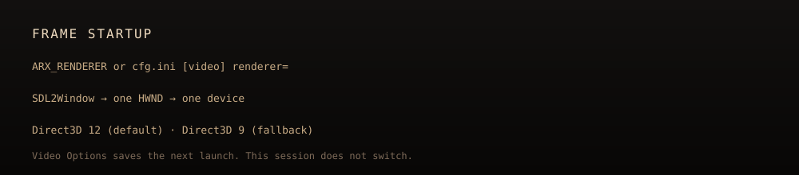

<p align="center">
  
</p>

<p align="center">
  
  
  
  
  
  
</p>

**Arx Raymix** renders *Arx Fatalis* through the **NVIDIA RTX Remix** runtime, so the dungeon gets
path-traced shadows, reflections, bounced light and PBR materials.

It is not a texture pack and not a generic wrapper. The work is inside the engine: a Direct3D 9
renderer that creates its device through the Remix runtime's own `d3d9.dll` and feeds it what a path
tracer needs — untransformed world-space geometry, per-vertex normals and real light sources —
instead of the screen-space triangles the original engine was happy to draw.

The lighting is deliberately a hybrid, and the reason is worth knowing before judging a screenshot.
A level holds several hundred lights and fixed-function D3D9 can carry only a handful at a time, so
the 2002 lightmaps are kept as the base and the tracer adds to them. Flames and magic are real
emissive geometry on top. Discarding the bake entirely is one flag away
(`--remix-debug 2097152`) and looks worse today, for that exact reason.

## Built on Arx Libertatis

This is a fork of [**Arx Libertatis**](https://arx-libertatis.org/), the open-source engine for Arx
Fatalis, combined with the [ArxWindows](https://github.com/arx/ArxWindows) dependency tree so the
whole thing builds from one clone.

| | |
|---|---|
| Upstream project | [arx/ArxLibertatis](https://github.com/arx/ArxLibertatis) |
| Base version | **Arx Libertatis 1.3-dev** |
| Base commit | `5b95e4c5ca9d583f1b11c085326979772645e0f3` (`git describe`: `1.2-2756-g5b95e4c5c`) |
| Windows dependencies | [arx/ArxWindows](https://github.com/arx/ArxWindows), vendored in `libs/` |

Upstream history is not carried in this repository. [`docs/UPSTREAM.md`](docs/UPSTREAM.md) lists every
file that differs from that commit, so the changes can be reviewed, rebased or taken out.

Everything Arx Libertatis does still works — this adds a rendering backend, it does not replace the
game. All credit for the engine belongs to the Arx Libertatis team; see
[`arx/AUTHORS`](arx/AUTHORS).

---

## Where it stands

<p align="center">
  
</p>

Work in progress, and the bars are meant literally.

### Working

- **One window, one device.** With `WITH_RTX_REMIX=ON`, `SDL2Window` builds a `D3D9Renderer` and no
  OpenGL renderer exists in the binary. The device is created with `Direct3DCreate9` resolved from
  the Remix DLL, which is what puts the game's draw calls in front of the path tracer.
- **World geometry is traced.** Level geometry is submitted untransformed as
  `D3DFVF_XYZ | D3DFVF_NORMAL | D3DFVF_DIFFUSE | D3DFVF_TEX1`, with smooth per-vertex normals
  computed from the faces of each batch.
- **Entities carry posed normals.** Characters are converted to world space, and each vertex normal
  is its rest-pose normal rotated by the animated quaternion of the bone that owns it.
- **Map lights are real lights.** Level lights are converted to `D3DLIGHT9` point lights each frame,
  with quadratic attenuation derived from the engine's `fallstart`/`fallend` fade.
- **In-game options page.** Path tracing, quality, DLSS, ray reconstruction, denoiser and bloom are
  exposed in the video options and applied immediately.
- **Flames light the room.** Fire, magic and flare sprites are built in world space, and additive
  draws are translated to emissive surfaces, so a torch lights the wall behind it.
- **Vanilla's lighting distribution is preserved.** Arx's baked vertex lighting is kept and fed
  to the runtime as lighting, with path-traced shadows, reflections and materials on top.
- **Remix developer menu** (`Alt+X`), including Debug View.

### Not working yet

- **Only a handful of map lights reach the tracer.** Fixed-function D3D9 caps how many lights can be
  active at once, and a level holds several hundred. The bake covers the rest, but that is a
  workaround rather than a fix — those lights cast no traced shadows.
- **Baked light cannot be shadowed.** Keeping Arx's lightmaps buys the original's light
  distribution, and pays for it with the original's shadows: paint on a surface is not a light
  source, so the tracer can neither occlude it nor bounce it.
- **The options page is unverified on screen.** The code applies every toggle, but whether turning
  path tracing off leaves a correct rasterised image has not been confirmed by looking at it.
- **Materials are flat constants.** On this path Remix derives materials from the D3D9 textures plus
  a single roughness and metallic constant. The DDS exporter and per-class material classification in
  `RemixTextures.cpp` belong to the older C API path, which the game does not run.

### Screenshots

None yet, deliberately. Every capture on hand is from an earlier, broken state of the renderer.

---

## How it works

<p align="center">
  
</p>

The engine keeps drawing D3D9; the Remix runtime is what presents. See
[`docs/ARCHITECTURE.md`](docs/ARCHITECTURE.md) for the details and
[`docs/CONFIGURATION.md`](docs/CONFIGURATION.md) for every runtime option the code sets.

---

## Requirements

| | |
|---|---|
| OS | Windows 10 or 11, x64 |
| GPU | NVIDIA RTX — Remix refuses to start without hardware ray tracing support and a recent driver |
| Game | Your own copy of **Arx Fatalis** (Steam or GOG). No game data is distributed here |
| Runtime | [RTX Remix](https://github.com/NVIDIAGameWorks/rtx-remix/releases) — developed against **1.5.2** |
| Toolchain | Visual Studio 2022 or newer with the C++ desktop workload, CMake 3.12+ |

## Building

```bash
git clone https://github.com/gabriel7silva/ArxRaymix.git
```

```bash
cmake -S . -B build -G "Visual Studio 17 2022" -A x64 -DWITH_RTX_REMIX=ON
```

```bash
cmake --build build --config RelWithDebInfo --target arx --parallel
```

`WITH_RTX_REMIX` defaults to `OFF`. With it on, CMake verifies that the vendored Remix header is
present and defines both `ARX_HAVE_RTX_REMIX` and `ARX_HAVE_D3D9`; the D3D9 renderer is then the only
backend compiled into the window. All Windows dependencies (Boost, SDL2, GLM, FreeType, OpenAL Soft,
libepoxy, zlib) are in `libs/`, so there is nothing else to fetch.

## Running

Download an RTX Remix release and extract it into `runtime/remix-extract/`, then:

```bash
powershell -ExecutionPolicy Bypass -File scripts/run-remix-scene.ps1 -LoadLevel 1
```

The script finds your Arx Fatalis install from the Steam and GOG registry entries; pass
`-DataDir '<path>'` to override. It is a convenience wrapper around:

```bash
build\arx\RelWithDebInfo\arx.exe --user-dir runtime\user --data-dir "<path to Arx Fatalis>" --remix-dll runtime\remix-extract\.trex\d3d9.dll
```

Use the x64 renderer at `.trex\d3d9.dll`. The `d3d9.dll` at the root of the Remix zip is the 32-bit
bridge and is not what this loads.

| Flag | Meaning |
|---|---|
| `--remix-dll <path>` | Which Remix runtime to render through. Without it, `.trex\d3d9.dll` and `d3d9.dll` next to the executable are tried, along with `ARX_REMIX_DLL` from the environment |
| `--data-dir <path>` | Your Arx Fatalis install, the directory holding `data.pak` |
| `--user-dir <path>` | Where saves, config and `arx.log` are written |
| `--loadlevel <n>` | Skip the menu and load a level directly |
| `--remix-probe[=frames]` | Render a triangle through the runtime with no game state — the way to tell a broken integration from a broken runtime or driver |
| `--remix-debug <mask>` | Debug bitmask; `128` forces the Remix developer UI on. Full list in `RemixConvert.h` |
| `--list-dirs` | Print the data directories actually in use, in priority order |

In game, **Video options → Raymix** has path tracing on/off, four quality levels, DLSS, ray
reconstruction, denoiser and bloom. **`Alt+X`** opens the Remix developer menu.

---

## Contributing

The interesting code is small and concentrated — see [`docs/CONTRIBUTING.md`](docs/CONTRIBUTING.md)
for where things live, how to debug them, and which claims in this README are still unverified.
Those unverified ones are the most useful place to start.

## Credits

- **Arkane Studios** — *Arx Fatalis*, 2002. This renders their game; it does not include it.
- **[Arx Libertatis](https://arx-libertatis.org/)** — the engine this forks. See
  [`arx/AUTHORS`](arx/AUTHORS) and [`arx/CHANGELOG`](arx/CHANGELOG).
- **[NVIDIA RTX Remix](https://github.com/NVIDIAGameWorks/rtx-remix)** — the runtime, and the C API
  header vendored under [`arx/third_party/rtx-remix/`](arx/third_party/rtx-remix/) (MIT).

Not affiliated with, or endorsed by, Arkane Studios, ZeniMax, or NVIDIA.

## License

GPLv3, inherited from Arx Libertatis — see [LICENSE](LICENSE). Parts of the engine source are under
more permissive licenses; the header of each file is authoritative. The vendored Remix API header is
MIT. Game data and the Remix runtime binaries are neither included nor redistributed.
