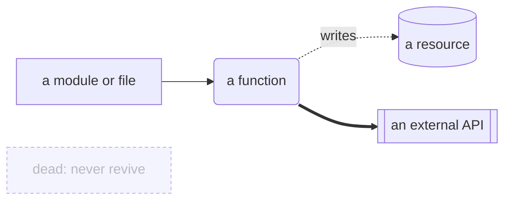
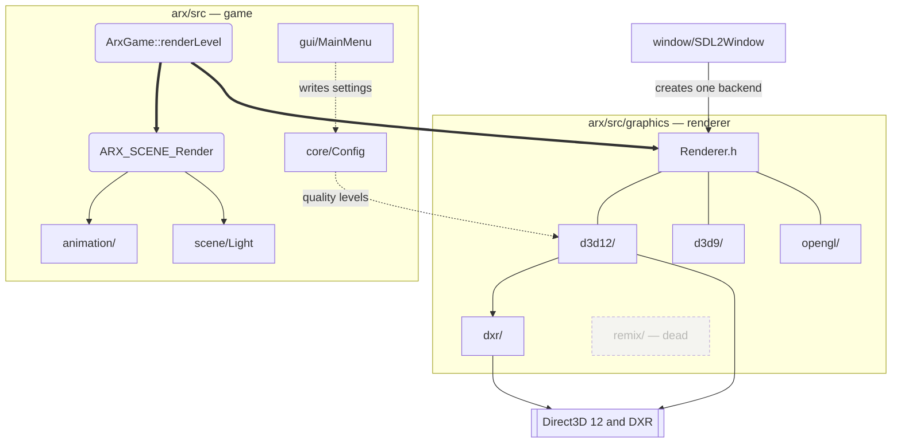
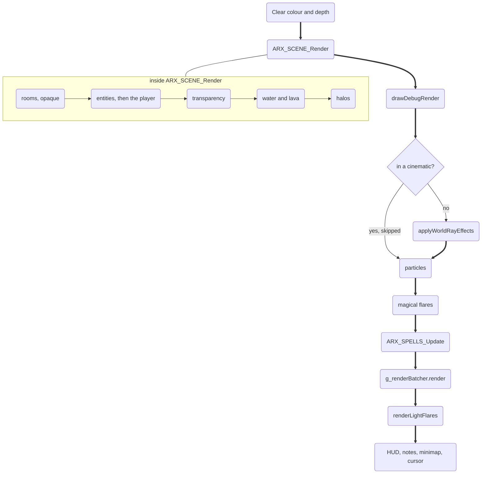
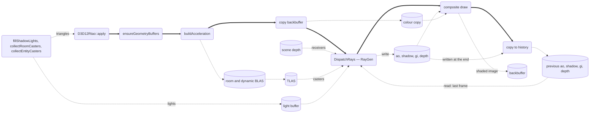
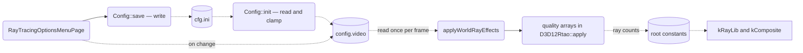

# Graph map

Four diagrams, each answering one question. Nodes are files, functions and resources — never values — which is what keeps them true while the numbers underneath change.

## How to read these

| Shape | Means |
|---|---|
| `["a name"]` | A module, directory or file |
| `("a name")` | A function or entry point |
| `[("a name")]` | A resource with contents: a texture, a buffer, a file on disk |
| `[["a name"]]` | An external boundary — not our code |
| `{"a question"}` | A run-time branch |

| Arrow | Means |
|---|---|
| `-->` | Calls, or runs before |
| `-.->` | Reads or writes data; the label names what flows |
| `==>` | The hot path a normal frame actually takes |
| Dashed outline | Dead code. Never revive |



## Graph 1 — Modules and ownership

Which pieces exist, and which way the dependencies point.



What this asserts, and you could disprove:

- One backend is created per process, by the window layer. There is no path that runs two.
- `dxr/` depends on `d3d12/`, never the reverse. Ray tracing is an addition to the raster, so removing it leaves a working renderer.
- `remix/` has no inbound edges at all.
- The menu writes settings; it never talks to the renderer.

Re-derive it by reading the backend construction in `arx/src/window/SDL2Window.cpp`.

## Graph 2 — One frame, in order

When your code runs, relative to everything else.



What this asserts:

- The ray tracing composite runs **after** the whole world is rastered and **before** particles, flares and the HUD. Additive effects must not be multiplied by the world's shading — see [INV-06](INVARIANTS.md#inv-06).
- It is skipped entirely during cinematics.
- Within the scene pass, opaque geometry precedes transparency, which precedes water.

Re-derive it by reading `ArxGame::renderLevel` in `arx/src/core/ArxGame.cpp` top to bottom, then `ARX_SCENE_Render` in `arx/src/scene/Scene.cpp`.

## Graph 3 — Inside the ray tracing pass

What feeds what, within one call.



What this asserts:

- History is copied at the **end** of the pass, so every history read inside a frame is last frame's data. There is no read-after-write hazard, and none of the history is valid on the first frame after a resize.
- Receivers come from the depth buffer, one per screen pixel. Casters come from the acceleration structure. They are different inputs and a bug in one does not look like a bug in the other.
- The backbuffer is copied before tracing, because the composite needs the unshaded image while it is also the render target.

Re-derive it by reading `D3D12Rtao::apply` in `arx/src/graphics/dxr/D3D12Rtao.cpp` top to bottom.

## Graph 4 — A setting's journey

Where a value goes after someone moves a slider. This is the diagram that explains why adding one option is five edits.



What this asserts:

- The menu writes the setting and saves it; it never reaches the renderer directly.
- The renderer reads the setting once per frame and turns it into ray counts through a per-quality array.
- Nothing on this path is skippable, which is why the recipe in [WHERE-TO-EDIT.md](WHERE-TO-EDIT.md) has five steps and not one.
- The clamp in `Config::init` and the length of the quality arrays are the same fact stated twice — see [INV-11](INVARIANTS.md#inv-11).

Re-derive it by following one setting name through the tree:

```
grep -rn "rtao" arx/src/core/Config.h arx/src/core/Config.cpp
```
